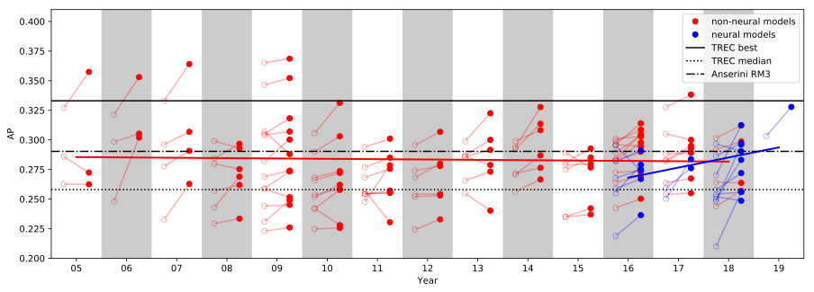

# Meta-Analysis of Robust04 Papers

This repro contains raw data from a meta-analysis of papers that used the test collection from the TREC 2004 Robust Track (Robust04), as described in:

+ Wei Yang, Kuang Lu, Peilin Yang, and Jimmy Lin. Critically Examining the "Neural Hype": Weak Baselines and the Additivity of Effectiveness Gains from Neural Ranking Models. Proceedings of the 42nd Annual International ACM SIGIR Conference on Research and Development in Information Retrieval (SIGIR 2019), July 2018, Paris, France.

## Methodology

We exhaustively examined every publication from 2005 to 2018 in the following venues to identify those that reported results on Robust04: SIGIR, CIKM, WWW, ICTIR, ECIR, KDD, WSDM, TOIS, IRJ, IPM, and JASIST.
This was supplemented by Google Scholar searches to identify a few additional papers not in the venues indicated above.
Our meta-analysis was conducted in January 2019, but after the paper acceptance we included a few more papers.
A number of exclusion criteria were applied, best characterized as discarding corner cases: for example, papers that only used a subset of the topics or papers that had metrics plotted in a graph.

For each of the 109 papers, we extracted the highest average precision score achieved on Robust04 by the authors' proposed methods, regardless of experimental condition (ignoring oracle conditions and other unrealistic setups). 
Some papers did not report AP, and therefore were excluded from our analysis.
We further categorized the papers into neural (18) and non-neural (91) approaches.
Methods that used word embeddings but not neural networks directly in ranking were considered "neural" in our classification.

As of the submission of the final camera-ready version of the SIGIR paper, we examined a total of 130 papers; of these, 109 papers contained extractable average precision values that formed the basis of our meta-analysis.

## Overview

A visualization of our meta-analysis is presented above.
For each paper, we show the baseline and the best result as an empty circle and a filled circle (respectively), connected by a line.
All papers are grouped by their publication year.
Neural approaches are shown in blue, and non-neural approaches in red.
We also show two regression trendlines, for non-neural (red) as well as neural approaches (blue).
A number of reference conditions are plotted as horizontal lines:
the best submitted run at the TREC 2004 Robust Track (TREC best) at 0.333 AP is shown as a solid black line, and the median TREC run under the "title" condition at 0.258 AP is shown as a dotted black line (TREC median).
Finally, we show the effectiveness of an untuned RM3 run (i.e., default parameters) from the [Anserini system](http://anserini.io).

## Results

The follow results table is generated via the Python script `json_to_md.py`, which summarizes the raw results in [`robust04_papers.json`](robust04_papers.json).
The column "standard" indicates if the paper used a "standard" configuration of Robust04; a non-standard configuration might be an evaluation that uses only a subset of the topics.
For the "non-standard" papers we did not extract effectiveness metrics, and in some of the "standard" papers effectiveness metrics were not easily extractable (e.g., they are presented in a graph).
In both cases AP values in the table were left blank.

| paper | standard? |neural? | baseline AP | best AP 
:-------|-----------|--------|:------------|:--------
| [Diaz (CIKM 2005)](https://lintool.github.io/robust04-analysis-papers/p672-diaz.pdf) | yes | no | 0.2626 | 0.2625
| [Liu et al. (CIKM 2005)](https://lintool.github.io/robust04-analysis-papers/p525-liu.pdf) | yes | no | 0.327 | 0.3574
| [He and Ounis (SIGIR 2005)](https://lintool.github.io/robust04-analysis-papers/p465-he.pdf) | yes | no | 0.2858 | 0.2724
| [Diaz and Metzler (SIGIR 2006)](https://lintool.github.io/robust04-analysis-papers/p154-diaz.pdf) | yes | no | 0.3214 | 0.353
| [Fang and Zhai (SIGIR 2006)](https://lintool.github.io/robust04-analysis-papers/p115-fang.pdf) | yes | no | 0.248 | 0.302
| [Amati (ECIR 2006)](https://lintool.github.io/robust04-analysis-papers/Amati2006_Chapter_FrequentistAndBayesianApproach.pdf) | yes | no | 0.2984 | 0.3052
| [Diaz (IRJ 2007)](https://lintool.github.io/robust04-analysis-papers/Diaz2007_Article_RegularizingQuery-basedRetriev.pdf) | yes | no | 0.2961 | 0.3068
| [He and Ounis (TOIS 2007)](https://lintool.github.io/robust04-analysis-papers/a13-he.pdf) | yes | no | 0.2777 | 0.2907
| [Zhang et al. (CIKM 2007)](https://lintool.github.io/robust04-analysis-papers/p711-zhang.pdf) | yes | no | 0.333 | 0.364
| [Troy and Zhang (SIGIR 2007)](https://lintool.github.io/robust04-analysis-papers/p599-troy.pdf) | yes | no | 0.2327 | 0.2628
| [Vechtomova and Karamuftuoglu (IPM 2008)](https://lintool.github.io/robust04-analysis-papers/1-s2.0-S0306457308000071-main.pdf) | yes | no | 0.2799 | 0.2753
| [Blanco and Barreiro (ECIR 2008)](https://lintool.github.io/robust04-analysis-papers/Blanco-Barreiro2008_Chapter_ProbabilisticDocumentLengthPri.pdf) | yes | no | 0.2844 | 0.2967
| [Bendersky and Croft (SIGIR 2008)](https://lintool.github.io/robust04-analysis-papers/p491-bendersky.pdf) | yes | no | 0.2569 | 0.262
| [Meij et al. (SIGIR 2008)](https://lintool.github.io/robust04-analysis-papers/p817-meij.pdf) | yes | no | 0.243 | 0.2689
| [Zighelnic and Kurland (SIGIR 2008)](https://lintool.github.io/robust04-analysis-papers/p825-zighelnic.pdf) | yes | no | 0.299 | 0.293
| [Xu et al. (SIGIR 2008)](https://lintool.github.io/robust04-analysis-papers/p855-xu.pdf) | yes | no | 0.2294 | 0.2335
| [Wu et al. (IPM 2009)](https://lintool.github.io/robust04-analysis-papers/1-s2.0-S0306457309000223-main.pdf) | yes | no | 0.3465 | 0.3522
| [Clinchant and Gaussier (ICTIR 2009)](https://lintool.github.io/robust04-analysis-papers/Clinchant-Gaussier2009_Chapter_BridgingLanguageModelingAndDiv.pdf) | yes | no | 0.269 | 0.274
| [Soskin et al. (ICTIR 2009)](https://lintool.github.io/robust04-analysis-papers/Soskin2009_Chapter_NavigatingInTheDarkModelingUnc.pdf) | yes | no | 0.307 | 0.288
| [Collins-Thompson (ICTIR 2009)](https://lintool.github.io/robust04-analysis-papers/Collins-Thompson2009_Chapter_RobustWordSimilarityEstimation.pdf) | yes | no |  | 
| [He and Ounis (CIKM 2009)](https://lintool.github.io/robust04-analysis-papers/p2011-he.pdf) | no | no |  | 
| [Zhu et al. (ECIR 2009)](https://lintool.github.io/robust04-analysis-papers/Zhu2009_Chapter_Risk-AwareInformationRetrieval.pdf) | yes | no |  | 
| [Lease et al. (ECIR 2009)](https://lintool.github.io/robust04-analysis-papers/Lease2009_Chapter_RegressionRankLearningToMeetTh.pdf) | yes | no | 0.2591 | 0.2733
| [Collins-Thompson (CIKM 2009)](https://lintool.github.io/robust04-analysis-papers/p837-collins-thompson.pdf) | yes | no | 0.2441 | 0.2451
| [Xu et al. (SIGIR 2009)](https://lintool.github.io/robust04-analysis-papers/p59-xu.pdf) | yes | no | 0.2823 | 0.3002
| [Zhu et al. (SIGIR 2009)](https://lintool.github.io/robust04-analysis-papers/p99-zhu.pdf) | yes | no | 0.223 | 0.226
| [Wang and Zhu (SIGIR 2009)](https://lintool.github.io/robust04-analysis-papers/p115-wang.pdf) | yes | no | 0.231 | 0.249
| [Lease (SIGIR 2009)](https://lintool.github.io/robust04-analysis-papers/p476-lease.pdf) | yes | no | 0.3052 | 0.3182
| [Kalmanovich and Kurland (SIGIR 2009)](https://lintool.github.io/robust04-analysis-papers/p646-kalmanovich.pdf) | yes | no | 0.304 | 0.307
| [Cormack et al. (SIGIR 2009)](https://lintool.github.io/robust04-analysis-papers/p758-cormack.pdf) | yes | no | 0.3652 | 0.3686
| [Bendersky et al. (SIGIR 2009)](https://lintool.github.io/robust04-analysis-papers/p810-bendersky.pdf) | yes | no | 0.2584 | 0.2516
| [Zheng and Fang (ECIR 2010)](https://lintool.github.io/robust04-analysis-papers/Zheng-Fang2010_Chapter_QueryAspectBasedTermWeightingR.pdf) | yes | no | 0.2421 | 0.2578
| [Bendersky et al. (WSDM 2010)](https://lintool.github.io/robust04-analysis-papers/p31-bendersky.pdf) | yes | no | 0.2661 | 0.2721
| [Piwowarski and Frommholz (CIKM 2010)](https://lintool.github.io/robust04-analysis-papers/p59-piwowarski.pdf) | yes | no | 0.242 | 0.228
| [Lang et al. (CIKM 2010)](https://lintool.github.io/robust04-analysis-papers/p249-lang.pdf) | yes | no | 0.3057 | 0.3313
| [Xue et al. (CIKM 2010)](https://lintool.github.io/robust04-analysis-papers/p1059-xue.pdf) | yes | no | 0.2683 | 0.2737
| [Dillon and Collins-Thompson (CIKM 2010)](https://lintool.github.io/robust04-analysis-papers/p1069-dillon.pdf) | yes | no | 0.2248 | 0.2256
| [Clinchant and Gaussier (SIGIR 2010)](https://lintool.github.io/robust04-analysis-papers/p234-clinchant.pdf) | yes | no | 0.29 | 0.303
| [Dang et al. (SIGIR 2010)](https://lintool.github.io/robust04-analysis-papers/p807-dang.pdf) | yes | no | 0.2538 | 0.2584
| [Park and Croft (SIGIR 2010)](https://lintool.github.io/robust04-analysis-papers/p829-park.pdf) | yes | no | 0.2517 | 0.2621
| [Clinchant and Gaussier (IRJ 2011)](https://lintool.github.io/robust04-analysis-papers/Clinchant-Gaussier2011_Article_RetrievalConstraintsAndWordFre.pdf) | yes | no | 0.277 | 0.285
| [Clinchant and Gaussier (ICTIR 2011)](https://lintool.github.io/robust04-analysis-papers/Clinchant-Gaussier2011_Chapter_IsDocumentFrequencyImportantFo.pdf) | yes | no | 0.294 | 0.301
| [Hui et al. (ICTIR 2011)](https://lintool.github.io/robust04-analysis-papers/Hui2011_Chapter_AComparativeStudyOfPseudoRelev.pdf) | no | no |  | 
| [Lv and Zhai (CIKM 2011)](https://lintool.github.io/robust04-analysis-papers/p7-lv.pdf) | yes | no | 0.2544 | 0.2553
| [Park et al. (CIKM 2011)](https://lintool.github.io/robust04-analysis-papers/p17-park.pdf) | yes | no | 0.2477 | 0.2786
| [Karimzadehgan and Zhai (CIKM 2011)](https://lintool.github.io/robust04-analysis-papers/p27-karimzadehgan.pdf) | yes | no |  | 
| [Hui et al. (CIKM 2011)](https://lintool.github.io/robust04-analysis-papers/p99-hui.pdf) | yes | no | 0.257 | 0.2304
| [Kotov and Zhai (CIKM 2011)](https://lintool.github.io/robust04-analysis-papers/p163-kotov.pdf) | yes | no |  | 
| [Lv and Zhai (CIKM 2011)](https://lintool.github.io/robust04-analysis-papers/p1985-lv.pdf) | yes | no | 0.2543 | 0.2571
| [Lv and Zhai (SIGIR 2011)](https://lintool.github.io/robust04-analysis-papers/p1103-lv.pdf) | yes | no | 0.2543 | 0.2553
| [Xue and Croft (SIGIR 2011)](https://lintool.github.io/robust04-analysis-papers/p1133-xue.pdf) | yes | no | 0.2683 | 0.2755
| [Blanco and Lioma (IRJ 2012)](https://lintool.github.io/robust04-analysis-papers/Blanco-Lioma2012_Article_Graph-basedTermWeightingForInf.pdf) | yes | no | 0.2243 | 0.2329
| [Lv and Zhai (ECIR 2012)](https://lintool.github.io/robust04-analysis-papers/Lv-Zhai2012_Chapter_ALog-LogisticModel-BasedInterp.pdf) | yes | no | 0.254 | 0.2543
| [Bendersky et al. (WSDM 2012)](https://lintool.github.io/robust04-analysis-papers/p443-bendersky.pdf) | yes | no | 0.2956 | 0.3068
| [Lv and Zhai (CIKM 2012)](https://lintool.github.io/robust04-analysis-papers/p1799-lv.pdf) | yes | no | 0.2521 | 0.253
| [Xue and Croft (SIGIR 2012)](https://lintool.github.io/robust04-analysis-papers/p525-xue.pdf) | yes | no | 0.2683 | 0.28
| [Bendersky and Croft (SIGIR 2012)](https://lintool.github.io/robust04-analysis-papers/p941-bendersky.pdf) | yes | no | 0.2741 | 0.2779
| [Huang et al. (IPM 2013)](https://lintool.github.io/robust04-analysis-papers/1-s2.0-S0306457312001082-main.pdf) | yes | no | 0.2857 | 0.2916
| [Na (IPM 2013)](https://lintool.github.io/robust04-analysis-papers/1-s2.0-S0306457312001215-main.pdf) | yes | no | 0.2987 | 0.3225
| [Xue and Croft (TOIS 2013)](https://lintool.github.io/robust04-analysis-papers/a6-xue.pdf) | yes | no | 0.2857 | 0.2788
| [Clinchant and Gaussier (ICTIR 2013)](https://lintool.github.io/robust04-analysis-papers/ICTIR13_Proceedings-paper6.pdf) | yes | no | 0.287 | 0.3
| [Wu and Fang (ICTIR 2013)](https://lintool.github.io/robust04-analysis-papers/ICTIR13_Proceedings-paper16.pdf) | no | no |  | 
| [Clinchant and Perronnin (ICTIR 2013)](https://lintool.github.io/robust04-analysis-papers/ICTIR13_Proceedings-paper25.pdf) | no | no |  | 
| [Rousseau and Vazirgiannis (CIKM 2013)](https://lintool.github.io/robust04-analysis-papers/p59-rousseau.pdf) | yes | no | 0.2547 | 0.2403
| [Raiber and Kurland (SIGIR 2013)](https://lintool.github.io/robust04-analysis-papers/p333-raiber.pdf) | yes | no |  | 
| [Maxwell and Croft (SIGIR 2013)](https://lintool.github.io/robust04-analysis-papers/p583-maxwell.pdf) | yes | no | 0.2657 | 0.2732
| [Deveaud et al. (SIGIR 2013)](https://lintool.github.io/robust04-analysis-papers/p1001-deveaud.pdf) | yes | no |  | 
| [Symonds et al. (JASIST 2014)](https://lintool.github.io/robust04-analysis-papers/Symonds_et_al-2014-Journal_of_the_Association_for_Information_Science_and_Technology.pdf) | yes | no | 0.2707 | 0.2869
| [Brosseau-Villeneuve et al. (IRJ 2014)](https://lintool.github.io/robust04-analysis-papers/Brosseau-Villeneuve2014_Article_LatentWordContextModelForInfor.pdf) | yes | no | 0.2922 | 0.3136
| [Kocabas et al. (IRJ 2014)](https://lintool.github.io/robust04-analysis-papers/Kocabaş2014_Article_ANonparametricTermWeightingMet.pdf) | yes | no | 0.2718 | 0.2764
| [Zhao et al. (TOIS 2014)](https://lintool.github.io/robust04-analysis-papers/a7-zhao.pdf) | yes | no | 0.2562 | 0.2666
| [Huston and Croft (CIKM 2014)](https://lintool.github.io/robust04-analysis-papers/p111-huston.pdf) | no | no |  | 
| [Ye and Huang (SIGIR 2014)](https://lintool.github.io/robust04-analysis-papers/p323-ye.pdf) | yes | no | 0.299 | 0.3082
| [Dalton et al. (SIGIR 2014)](https://lintool.github.io/robust04-analysis-papers/p365-dalton.pdf) | yes | no | 0.2938 | 0.3277
| [Lv and Zhai (IRJ 2015)](https://lintool.github.io/robust04-analysis-papers/Lv-Zhai2015_Article_NegativeQueryGenerationBridgin.pdf) | yes | no | 0.2788 | 0.2797
| [Na (TOIS 2015)](https://lintool.github.io/robust04-analysis-papers/a8-na.pdf) | yes | no | 0.2813 | 0.2927
| [Costa et al. (TOIS 2015)](https://lintool.github.io/robust04-analysis-papers/a6-costa.pdf) | no | no |  | 
| [Raiber et al. (ICTIR 2015)](https://lintool.github.io/robust04-analysis-papers/p281-raiber.pdf) | yes | no | 0.235 | 0.237
| [Diaz (ICTIR 2015)](https://lintool.github.io/robust04-analysis-papers/p313-diaz.pdf) | yes | no | 0.2892 | 0.2767
| [Lv (CIKM 2015)](https://lintool.github.io/robust04-analysis-papers/p1747-lv.pdf) | yes | no | 0.2352 | 0.2422
| [Zheng and Callan (SIGIR 2015)](https://lintool.github.io/robust04-analysis-papers/p575-zheng.pdf) | yes | no | 0.2749 | 0.2851
| [Ye and Huang (JASIST 2016)](https://lintool.github.io/robust04-analysis-papers/Ye_et_al-2016-Journal_of_the_Association_for_Information_Science_and_Technology.pdf) | yes | no | 0.299 | 0.3086
| [Miao et al. (TOIS 2016)](https://lintool.github.io/robust04-analysis-papers/a22-miao.pdf) | yes | no | 0.2894 | 0.3035
| [Diaz (ECIR 2016)](https://lintool.github.io/robust04-analysis-papers/Diaz2016_Chapter_Pseudo-QueryReformulation.pdf) | yes | no | 0.2726 | 0.2736
| [Balaneshinkordan and Kotov (ECIR 2016)](https://lintool.github.io/robust04-analysis-papers/Balaneshinkordan-Kotov2016_Chapter_AnEmpiricalComparisonOfTermAss.pdf) | yes | no | 0.2426 | 0.2503
| [Cummins (WWW 2016)](https://lintool.github.io/robust04-analysis-papers/p795-cummins.pdf) | yes | no | 0.296 | 0.314
| [Raviv et al. (SIGIR 2016)](https://lintool.github.io/robust04-analysis-papers/p65-raviv.pdf) | yes | no | 0.284 | 0.305
| [Montazeralghaem et al. (SIGIR 2016)](https://lintool.github.io/robust04-analysis-papers/p765-montazeralghaem.pdf) | yes | no | 0.2829 | 0.2979
| [Ai et al. (SIGIR 2016)](https://lintool.github.io/robust04-analysis-papers/p869-ai.pdf) | yes | yes | 0.259 | 0.267
| [Lu et al. (ICTIR 2016)](https://lintool.github.io/robust04-analysis-papers/p21-lu.pdf) | yes | no | 0.264 | 0.27
| [Zamani and Croft (ICTIR 2016)](https://lintool.github.io/robust04-analysis-papers/p123-zamani.pdf) | yes | yes | 0.219 | 0.2364
| [Ai et al. (ICTIR 2016)](https://lintool.github.io/robust04-analysis-papers/p133-ai.pdf) | yes | yes |  | 
| [Zamani and Croft (ICTIR 2016)](https://lintool.github.io/robust04-analysis-papers/p147-zamani-2016.pdf) | yes | yes | 0.2677 | 0.275
| [Balaneshin-kordan and Kotov (ICTIR 2016)](https://lintool.github.io/robust04-analysis-papers/p233-balaneshin-kordan.pdf) | no | no |  | 
| [Guo et al. (CIKM 2016)](https://lintool.github.io/robust04-analysis-papers/p55-guo.pdf) | yes | yes | 0.255 | 0.279
| [Balaneshin-kordan and Kotov (CIKM 2016)](https://lintool.github.io/robust04-analysis-papers/p155-balaneshin-kordan.pdf) | no | no |  | 
| [Guo et al. (CIKM 2016)](https://lintool.github.io/robust04-analysis-papers/p701-guo.pdf) | yes | yes | 0.295 | 0.274
| [Dehghani et al. (CIKM 2016)](https://lintool.github.io/robust04-analysis-papers/p1301-dehghani.pdf) | yes | no | 0.2961 | 0.2945
| [Anava et al. (CIKM 2016)](https://lintool.github.io/robust04-analysis-papers/p1463-anava.pdf) | yes | no | 0.301 | 0.303
| [Levi et al. (CIKM 2016)](https://lintool.github.io/robust04-analysis-papers/p1473-levi.pdf) | yes | no |  | 
| [Zamani et al. (CIKM 2016)](https://lintool.github.io/robust04-analysis-papers/p1483-zamani.pdf) | yes | no | 0.282 | 0.2899
| [Kuzi et al. (CIKM 2016)](https://lintool.github.io/robust04-analysis-papers/p1929-kuzi.pdf) | yes | yes | 0.282 | 0.291
| [Ariannezhad et al. (ECIR 2017)](https://lintool.github.io/robust04-analysis-papers/Ariannezhad2017_Chapter_IterativeEstimationOfDocumentR.pdf) | yes | no | 0.2822 | 0.2926
| [Yang and Fang (ICTIR 2017)](https://lintool.github.io/robust04-analysis-papers/p43-yang.pdf) | no | no |  | 
| [Ensan and Bagheri (WSDM 2017)](https://lintool.github.io/robust04-analysis-papers/p181-ensan.pdf) | yes | no | 0.3278 | 0.3382
| [Dehghani et al. (SIGIR 2017)](https://lintool.github.io/robust04-analysis-papers/p65-dehghani.pdf) | yes | yes | 0.2503 | 0.2837
| [Zamani and Croft (SIGIR 2017)](https://lintool.github.io/robust04-analysis-papers/p505-zamani.pdf) | yes | yes | 0.2593 | 0.2761
| [Sherman and Efron (SIGIR 2017)](https://lintool.github.io/robust04-analysis-papers/p1045-sherman.pdf) | yes | no | 0.2639 | 0.2674
| [Montazeralghaem et al. (SIGIR 2017)](https://lintool.github.io/robust04-analysis-papers/p1085-montazeralghaem.pdf) | yes | no | 0.2829 | 0.295
| [Ariannezhad et al. (SIGIR 2017)](https://lintool.github.io/robust04-analysis-papers/p1201-ariannezhad.pdf) | yes | no | 0.254 | 0.255
| [Cummins (ICTIR 2017)](https://lintool.github.io/robust04-analysis-papers/p101-cummins.pdf) | yes | no | 0.305 | 0.3
| [Raiber and Kurland (ICTIR 2017)](https://lintool.github.io/robust04-analysis-papers/p117-raiber.pdf) | yes | no | 0.288 | 0.289
| [Na and Kim (IPM 2018)](https://lintool.github.io/robust04-analysis-papers/1-s2.0-S0306457317307082-main.pdf) | yes | no | 0.3015 | 0.3122
| [Hubert et al. (IPM 2018)](https://lintool.github.io/robust04-analysis-papers/1-s2.0-S0306457316305222-main.pdf) | no | no |  | 
| [Van Gysel et al. (TOIS 2018)](https://lintool.github.io/robust04-analysis-papers/a38-gysel.pdf) | no | no |  | 
| [Ai et al. (ECIR 2018)](https://lintool.github.io/robust04-analysis-papers/Ai2018_Chapter_ANeuralPassageModelForAd-hocDo.pdf) | yes | yes | 0.21 | 0.256
| [Zhang et al. (ECIR 2018)](https://lintool.github.io/robust04-analysis-papers/Zhang2018_Chapter_AggregatingNeuralWordEmbedding.pdf) | yes | yes | 0.254 | 0.256
| [Zou et al. (ICTIR 2018)](https://lintool.github.io/robust04-analysis-papers/p43-zou.pdf) | yes | no | 0.244 | 0.257
| [Zamani and Croft (ICTIR 2018)](https://lintool.github.io/robust04-analysis-papers/p147-zamani-2018.pdf) | yes | yes | 0.2499 | 0.2831
| [Li and Jia (CIKM 2018)](https://lintool.github.io/robust04-analysis-papers/p1739-li.pdf) | yes | yes | 0.248 | 0.296
| [Bagheri et al. (CIKM 2018)](https://lintool.github.io/robust04-analysis-papers/p1635-bagheri.pdf) | yes | yes |  | 
| [Zamani et al. (CIKM 2018)](https://lintool.github.io/robust04-analysis-papers/p497-zamani.pdf) | yes | yes | 0.2865 | 0.2971
| [Roy et al. (CIKM 2018)](https://lintool.github.io/robust04-analysis-papers/p1835-roy.pdf) | yes | yes | 0.252 | 0.2486
| [Jian et al. (SIGIR 2018)](https://lintool.github.io/robust04-analysis-papers/p1237-jian.pdf) | yes | no | 0.2642 | 0.2637
| [Montazeralghaem et al. (SIGIR 2018)](https://lintool.github.io/robust04-analysis-papers/p1249-montazeralghaem.pdf) | yes | no | 0.2919 | 0.2986
| [Li et al. (EMNLP 2018)](https://lintool.github.io/robust04-analysis-papers/D18-1478.pdf) | yes | yes | 0.2966 | 0.2904
| [McDonald et al. (EMNLP 2018)](https://lintool.github.io/robust04-analysis-papers/D18-1211.pdf) | yes | yes | 0.258 | 0.272
| [Dehghani et al. (ICLR 2018)](https://lintool.github.io/robust04-analysis-papers/b02079b368ddc201cb4177719f6e58958cde9be6.pdf) | yes | yes | 0.2702 | 0.3124
| [Yang et al. (arXiv 2019)](https://lintool.github.io/robust04-analysis-papers/1903.10972.pdf) | yes | yes | 0.3033 | 0.3278
| [MacAvaney et al. (arXiv 2019)](https://lintool.github.io/robust04-analysis-papers/1904.07094.pdf) | yes | yes |  | 
